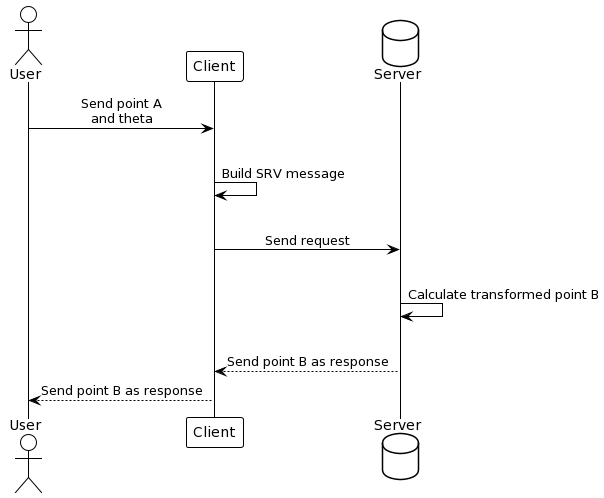
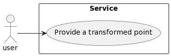

# apply_transform
This repository was developed to accomplish the proposed challenge of to get a transformed point B obtained from the point PA = [aPx aPy aPz] after applying a translation of [ 1 2 3 ] and a rotation around x axis of theta degrees. Also, it was required to document the solution through a Use Case Diagram and a Sequence Diagram.

*Note: this package was developed and tested on ROS2 humble with Ubuntu 22.04 LTS*

## Mathematical definition
A general transformation between two points can be defined as follow:

$$^{B}P=^{B}_AT^{A}P$$

Which is equivalent to:

```math
\begin{bmatrix}
^{B}P_x\\ 
^{B}P_y\\ 
^{B}P_z\\
1
\end{bmatrix}
=
\begin{bmatrix}
1 & 0 & 0 & 1\\ 
0 & \cos(\theta) & -\sin(\theta) & 2\\ 
0 & \sin(\theta) & \cos(\theta) & 3\\ 
0 & 0 & 0 & 1
\end{bmatrix}
\begin{bmatrix}
^{A}P_x\\ 
^{A}P_y\\ 
^{A}P_z\\
1
\end{bmatrix}
```

And can be evaluated to:

$$ 
\left\{\begin{matrix}
^{B}P_x = ^{A}P_x+1\\ 
^{B}P_y = \cos(\theta)^{A}P_y -\sin(\theta)^{A}P_z + 2\\ 
^{B}P_z = \sin(\theta)^{A}P_y +\cos(\theta)^{A}P_z + 3
\end{matrix}\right.
$$

## Inputs and Outputs
The expected inputs are:
- $^{A}P$
- angle θ (in degrees); This angle should be between 0 and 90 degrees.
Otherwise, the server must return an error

While the outputs are:
- $^{B}P$
- Status message
- Success boolean

So, to implement this interface, the following srv structure, available on the srv/ folder, was created:
```bash
float64[3] point_a
float64 theta
---
float64[3] point_b
string message
bool sucess
``` 
## Project documentation
The sequence diagram of the solution is presented bellow. Firstly, the user send a point and a rotation angle (around x-axis) to the client. This prepare the SRV message and send the information forward to the server. This one make the mathematical operations to calculate the desired point B, which is send back to the client as a response and, finally, achieve the user.

<div align="center">
  
</div>

The use case is also presented. As it is a relatively simple project, the only existing case is to provide for the user the desired transform.

<div align="center">
  
</div>

## Setup
First, create your workspace
```bash
$ mkdir ~/ros2_ws/src -p
``` 

Build and source the package
```bash
$ cd ~/ros2_ws/
$ colcon build
$ source install/setup.bash
``` 

## Usage
Start the server
```bash
$ ros2 run apply_transform get_transform_server
``` 

Run the client, passing the components of $^{A}P$ vector and desired angle of rotation
```bash
$ ros2 run apply_transform get_transform_client <aPx> <aPy> <aPz> <theta>
``` 